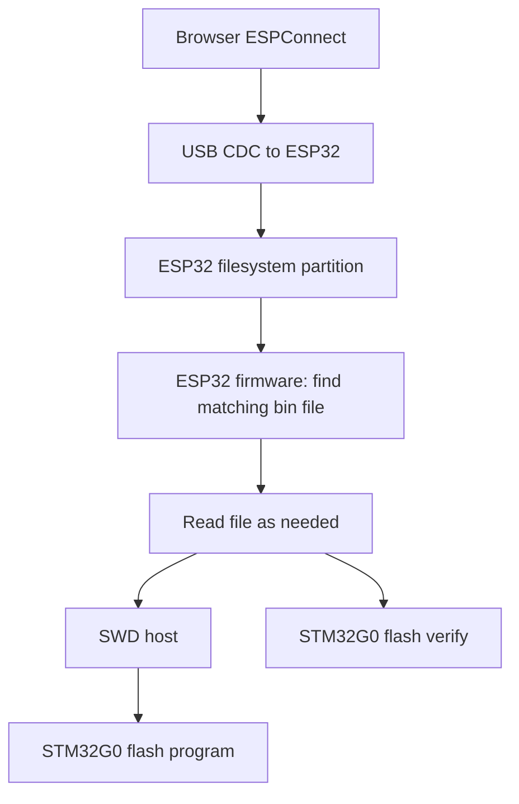

# Firmware file storage on ESP32-S3 (move from embedded header to on-device filesystem)

## Feasibility (based on current repo + your ESPConnect tooling)

This repo is transitioning from embedding the target STM32 firmware into the ESP32-S3 firmware image as a C byte array to storing the STM32 firmware as a file in an ESP32 filesystem, and then programs + verifies the STM32 by reading that file.

- [`cpp.stm32g0_prog::flash_program()`](src/stm32g0_prog.cpp:549)
- [`cpp.stm32g0_prog::flash_verify_fast()`](src/stm32g0_prog.cpp:671)

Your stated goal is to **deprecate the embedded-header approach** and instead **store the STM32 `.bin` as a file** in a real filesystem on the ESP32-S3, with files managed from a browser over USB using ESPConnect.

Given that ESPConnect already supports:

- SPIFFS tools
- LittleFS tools
- FATFS tools
- partition inspection

it is **practically feasible** to manage a firmware `.bin` as a file on the ESP32-S3, and have the device read that file as the source for programming and verification.

The remaining engineering work is primarily:

1. Selecting which filesystem/partition scheme to use.
2. Defining a deterministic filename selection policy (pattern matching, tie-breaking).
3. Updating the programmer implementation to read firmware bytes from a file stream (likely chunked) rather than from a compile-time array.

## My understanding of the task (what “done” means)

### Desired end state

1. The ESP32-S3 firmware includes a filesystem mount (LittleFS/SPIFFS/FATFS) and expects a firmware file to exist there.
2. A browser-based tool (ESPConnect) is used to:
   - upload a new `.bin` to the device
   - delete/rename/list firmware files
3. When the user runs the programmer commands (or production `<space>` sequence) on the ESP32-S3, the firmware:
   - **finds** the firmware file whose name matches a configured pattern
   - uses that file as the **source of bytes** for:
     - programming the STM32 target flash
     - verifying the STM32 target flash
4. The embedded firmware mechanism is deprecated and removed.

### What must change in this repo

`write` and `verify` now use a firmware file stored on-device (LittleFS).

To switch to filesystem-backed firmware, the code needs a new abstraction so the STM32 programmer can consume firmware bytes from a file stream on the ESP32 filesystem.

Concretely:

- [`cpp.stm32g0_prog::flash_program_reader()`](src/stm32g0_prog.cpp:627) consumes firmware bytes via a read-at-offset interface and programs in 8-byte (doubleword) units.
- [`cpp.stm32g0_prog::flash_verify_fast_reader()`](src/stm32g0_prog.cpp:905) consumes firmware bytes via the same interface and verifies in 4-byte (word) units.

If the `.bin` can be large, the ESP32 should not necessarily `malloc` the entire file. The implementation reads only what is needed per operation:

- open firmware file
- for programming: read 8 bytes at a time (pad past EOF with 0xFF to complete the last doubleword)
- for verify: read 4 bytes at a time (pad past EOF with 0xFF) and compare to target flash
- repeat until the padded length is exhausted

That likely implies either:

- adding new chunked APIs (for example, `flash_program_stream` / `flash_verify_stream`), or
- refactoring the existing routines to accept a callback interface like `read_at(offset, buf, n)`.

### Filename matching / selection policy

The device needs a deterministic way to pick a file. My understanding is:

- There is a filename pattern (example: `bootloader*.bin`).
- The ESP32 scans a directory (often `/` on SPIFFS/LittleFS, or a folder) and selects:
  - the only match; or
  - if multiple matches exist then it is an error and nothing should be written or verified

This policy needs to be explicit because production flows must be deterministic.

## Partitioning + storage constraints (known unknowns for this repo)

This repo now defines a custom partition table in [`platformio.ini`](platformio.ini:1), so we must ensure:

- a filesystem partition exists with label `fwfs` and size sufficient for at least ~200kB firmware files
- it is mounted via LittleFS (Arduino-ESP32) using partition label `fwfs`

Uncertainties I will not assume:

- Which filesystem (LittleFS vs SPIFFS vs FATFS) you want to standardize on.
   A: LittleFS.
- How large the `.bin` can be and how much flash you can allocate for it.
   A: Let's keep at least 200kB for files. Later I may add more files for other purposes.
- Whether ESPConnect expects a particular partition label.
   A: I doubt it. I believe it should be able to see any partition but I have never tried before so let's just see.

## Data flow diagram

## Acceptance checks (what we will validate in implementation)

1. Firmware can mount the chosen filesystem and list files.
2. Firmware can locate exactly the intended `.bin` given the configured filename pattern.
3. `w` (write) uses the file-backed firmware and succeeds.
4. `v` (verify) uses the same file-backed firmware and succeeds.
5. Benchmarks still print meaningful throughput (bytes read/programmed).
6. Build remains warning-free (`pio run` clean).
