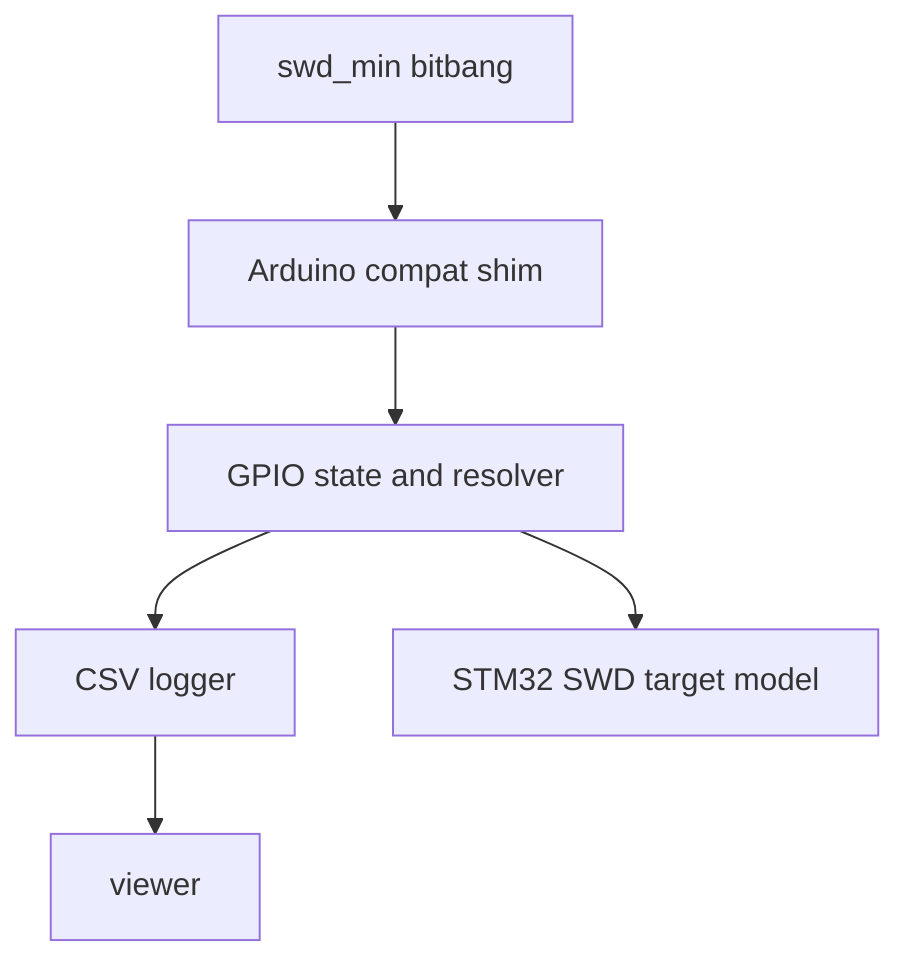

# SWD Signal Simulator + Waveform Viewer

## Goal

Create a macOS-hosted simulator that:

1. Runs the **same SWD bit-bang code** as the ESP32 firmware (compile [`src/swd_min.cpp`](src/swd_min.cpp) directly).
2. Replaces Arduino/ESP32 primitives (`pinMode`, `digitalWrite`, `digitalRead`, `delay`, `delayMicroseconds`) with a host shim.
3. Logs **resolved SWCLK/SWDIO voltages vs time** to a file.
4. Simulates an STM32 SWD target sufficiently to respond to the **full programming flow**:
   - DP IDCODE read
   - DP init/power-up (CTRL/STAT handshake)
   - AHB-AP memory access
   - Flash mass erase
   - Flash program (8-byte example payload)
   - Flash verify (readback)
5. Provides a separate visualization tool with **pan + zoom**.
6. Overlays **sampling markers** on the SWDIO plot to show when the host and simulated target *sampled* SWDIO.

Notes on sampling markers:

- **Host sample time** is defined as the timestamp of the simulator’s implementation of [`digitalRead()`](sim/arduino_compat/arduino_compat.cpp:187) when reading the SWDIO pin. This corresponds to the exact sampling point in the host algorithm (see [`swd_min::read_bit()`](src/swd_min.cpp:72) -> [`swdio_read()`](src/swd_min.cpp:38)).
- **Target sample time** is defined as the timestamp of the simulated target’s SWCLK rising-edge handler when it is consuming host-driven bits (see [`sim::Stm32SwdTarget::on_swclk_rising_edge()`](sim/stm32_swd_target.cpp:303)). This is simulator-only logic and does not need to match ESP32 constraints.

Marker meanings in the Plotly viewer:

- Blue/orange circles on SWDIO show sampling moments:
  - Blue = host sampled a target-driven bit
  - Orange = target sampled a host-driven bit
- The number in the circle is the **bit index within the current SWD field** (matches SWD packet diagrams):
  - request: 1..8
  - ACK: 1..3
  - data: 1..32
  - parity: 33
- Green triangle markers (`STEP_*`) include protocol **phase transitions** (e.g. `STEP_PHASE_SendAck_Read`) to make it easy to orient while panning/zooming.

## New standalone simulations (separate executables)

These simulators are **separate from the full-flow** simulator (`swd_sim`). Each simulator:

- Produces a dedicated CSV event log in the repository root:
  - `reset_and_switch_to_swd_simulation.csv`
  - `read_simulation.csv`
  - `write_simulation.csv`
- Is intended to be visualized by running [`viewer/view_log.py`](viewer/view_log.py:1) on that CSV, which generates `waveforms.html` and opens it in a browser.
- Emits high-level step markers (`STEP_*`) to help locate regions while panning/zooming.

### 1) `reset_and_switch_to_swd_simulation`

**Purpose**: isolate and validate the **attach/initialization** waveform only (no SWD transactions).

**Sequence** (host actions):

1. Configure pins (same as firmware) via [`swd_min::begin()`](src/swd_min.cpp:343).
2. Execute the attach procedure via [`swd_min::reset_and_switch_to_swd()`](src/swd_min.cpp:361), including:
   - NRST asserted LOW
   - line reset (`>50` SWCLK cycles with SWDIO HIGH)
   - JTAG-to-SWD sequence (`0xE79E`, 16 bits LSB-first)
   - another line reset
   - idle cycles

**Expected waveform features**:

- NRST stays LOW throughout.
- Two long regions of SWDIO HIGH + clocking (line reset).
- One 16-bit burst corresponding to `0xE79E`.
- No ACK/data phases (no target-driven SWDIO expected).

**Output**: `reset_and_switch_to_swd_simulation.csv`.

### 2) `read_simulation`

**Purpose**: isolate a **single SWD read transaction** (after init) and its turnaround timing.

**Sequence**:

1. Run the full attach sequence via [`swd_min::reset_and_switch_to_swd()`](src/swd_min.cpp:361).
2. Perform exactly one DP read of IDCODE via [`swd_min::read_idcode()`](src/swd_min.cpp:379).

**Expected waveform features**:

- All init waveform features from `reset_and_switch_to_swd_simulation`.
- A request header (host-driven SWDIO) followed by turnaround (host releases SWDIO).
- ACK (3 bits) + 32-bit data + parity driven by the target model.
- Target drive should end, then host drives SWDIO back to idle HIGH.

**Output**: `read_simulation.csv`.

### 3) `write_simulation`

**Purpose**: isolate a **single SWD write transaction** (after init) and its turnaround timing.

**Sequence**:

1. Run the full attach sequence via [`swd_min::reset_and_switch_to_swd()`](src/swd_min.cpp:361).
2. Perform exactly one DP write (e.g. DP SELECT) via [`swd_min::dp_write_reg()`](src/swd_min.cpp:388).

**Expected waveform features**:

- All init waveform features from `reset_and_switch_to_swd_simulation`.
- A request header (host-driven SWDIO) followed by turnaround (host releases SWDIO).
- ACK (3 bits) driven by the target model.
- Turnaround back to host, then 32-bit data + parity driven by the host.
- No target-driven data phase.

**Output**: `write_simulation.csv`.

### 4) `read_then_write_simulation`

**Purpose**: validate a **read -> write transition** without re-attaching (turnaround correctness when switching directions between transactions).

**Sequence**:

1. Run the full attach sequence via [`swd_min::reset_and_switch_to_swd()`](src/swd_min.cpp:382).
2. Perform one DP read of IDCODE via [`swd_min::read_idcode()`](src/swd_min.cpp:400).
3. Immediately perform one DP write of SELECT via [`swd_min::dp_write_reg()`](src/swd_min.cpp:409).

**Expected waveform features**:

- All init waveform features from `reset_and_switch_to_swd_simulation`.
- A full read transaction (target drives ACK+data+parity) followed by the host returning SWDIO to idle.
- Between the read and the write, the host clocks an **idle/flush window** with SWDIO held **LOW** (see [`SWD_POST_IDLE_LOW_CYCLES`](src/swd_min.cpp:127)), and then (optionally) a couple of additional idle-low bits before the next request (see [`SWD_REQ_IDLE_LOW_BITS`](src/swd_min.cpp:166)).
- A subsequent write transaction where:
  - the host drives the request header,
  - releases for target ACK,
  - then re-takes SWDIO to drive data+parity.
- No SWDIO contention (`1.65V`) at either transaction boundary.

**Output**: `read_then_write_simulation.csv`.

### 5) `write_then_read_simulation`

**Purpose**: validate a **write -> read transition** without re-attaching (turnaround correctness when switching directions between transactions).

**Sequence**:

1. Run the full attach sequence via [`swd_min::reset_and_switch_to_swd()`](src/swd_min.cpp:382).
2. Perform one DP write of SELECT via [`swd_min::dp_write_reg()`](src/swd_min.cpp:409).
3. Immediately perform one DP read of IDCODE via [`swd_min::read_idcode()`](src/swd_min.cpp:400).

**Expected waveform features**:

- All init waveform features from `reset_and_switch_to_swd_simulation`.
- A full write transaction (host drives header and data) followed by the host releasing SWDIO back to idle.
- Between the write and the read, the host clocks an **idle/flush window** with SWDIO held **LOW** (see [`SWD_POST_IDLE_LOW_CYCLES`](src/swd_min.cpp:127)), and then (optionally) a couple of additional idle-low bits before the next request (see [`SWD_REQ_IDLE_LOW_BITS`](src/swd_min.cpp:166)).
- A subsequent read transaction where:
  - host releases for target-driven ACK+data+parity,
  - and target releases back for host to drive idle.
- No SWDIO contention (`1.65V`) at either transaction boundary.

**Output**: `write_then_read_simulation.csv`.

### Build + run the standalone sims (quick commands)

Build everything (full-flow sim + standalone sims):

```bash
cmake -S sim -B sim/build
cmake --build sim/build
```

Run one of the standalone sims (writes CSV into the repo root):

```bash
  ./sim/build/reset_and_switch_to_swd_simulation
  ./sim/build/read_simulation
  ./sim/build/write_simulation
  ./sim/build/read_then_write_simulation
  ./sim/build/write_then_read_simulation
  ./sim/build/read_flash_simulation
  ./sim/build/erase_flash_simulation
```

View a CSV in the browser (generates `waveforms.html` and opens it):

```bash
  python3 viewer/view_log.py reset_and_switch_to_swd_simulation.csv
  python3 viewer/view_log.py read_simulation.csv
  python3 viewer/view_log.py write_simulation.csv
  python3 viewer/view_log.py read_then_write_simulation.csv
  python3 viewer/view_log.py write_then_read_simulation.csv
  python3 viewer/view_log.py read_flash_simulation.csv
  python3 viewer/view_log.py erase_flash_simulation.csv
```

Note: [`viewer/view_log.py`](viewer/view_log.py:1) writes an HTML file next to the CSV with the same basename, e.g. `read_simulation.csv` -> `read_simulation.html`.

## Voltage encoding (as required)

When writing the log, represent SWDIO voltage as:

- `0.0` = host drives low
- `3.3` = host drives high
- `0.2` = floating with host pull-down
- `3.1` = floating with host pull-up
- `0.1` = STM32 drives low
- `3.2` = STM32 drives high
- `1.65` = **contention** (host and target both driving SWDIO). This is an error case we must detect; we will not crash, but we will set a flag and print a large warning at end of simulation.

SWCLK is host-driven only:
- `0.0` low, `3.3` high

## Architecture



## Code reuse strategy (minimal changes)

### Compile `swd_min` as-is

Avoid editing [`src/swd_min.cpp`](src/swd_min.cpp). Instead, for the host build:

- Provide a stub header named `Arduino.h` earlier in the include path than the real Arduino core.
- Implement compatible symbols:
  - `pinMode(int pin, int mode)`
  - `digitalWrite(int pin, int value)`
  - `int digitalRead(int pin)`
  - `delay(unsigned ms)`
  - `delayMicroseconds(unsigned us)`
  - constants: `HIGH`, `LOW`, `INPUT`, `OUTPUT`, `INPUT_PULLUP`
  - helpers/macros used by `swd_min`: `F(...)`, `__FlashStringHelper`

This lets the simulator build the same algorithm source file.

## Repository layout

Create two host-side subprojects:

- `sim/` (C++): produces `swd_sim` executable
  - `sim/CMakeLists.txt`
  - `sim/arduino_compat/Arduino.h` (stub)
  - `sim/arduino_compat/arduino_compat.cpp` (shim implementation)
  - `sim/gpio_model.h/.cpp` (pin modes, pullups, resolved voltages)
  - `sim/logger.h/.cpp` (CSV log writer)
  - `sim/stm32_swd_target.h/.cpp` (SWD target responder)
  - `sim/main.cpp` (calls `swd_min::begin`, `reset_and_switch_to_swd`, `read_idcode`, prints result)

- `viewer/` (Python or JS): produces an interactive waveform viewer
  - Preferred: `viewer/view_log.py` using Plotly (interactive pan/zoom in browser)

## Timing model

Simulator maintains monotonic `uint64_t t_ns`.

- `delayMicroseconds(us)` => `t_ns += us * 1000`
- `delay(ms)` => `t_ns += ms * 1000000`
- `pinMode` and `digitalWrite` are instantaneous (log at current `t_ns`)

Optional later: add a small per-call cost if needed.

## GPIO model + resolution

Track per pin:

- direction: input or output
- output value: 0 or 1
- input pull: none, pull-up, pull-down

Resolved voltage for SWDIO at any time:

0. **Contention detection (first priority)**:
   - If **host is OUTPUT** and **target is driving** at the same time, this is illegal.
   - Set `contention_seen = true` and log SWDIO voltage as `1.65` at that time so it is visually obvious.

1. If target is driving SWDIO:
   - drive 0 => `0.1`
   - drive 1 => `3.2`
2. Else if host pin is OUTPUT:
   - output 0 => `0.0`
   - output 1 => `3.3`
3. Else (host input):
   - pull-down => `0.2`
   - pull-up => `3.1`
   - no pull => choose `3.1` (default idle high) unless you prefer `nan` (we can pick one)

Resolved voltage for SWCLK is always host output (`0.0` or `3.3`).

## STM32 SWD target model (IDCODE only)

Implement a minimal state machine driven by SWCLK edges.

### Target behaviors required for the full flow

The simulator target is expected to support at least:

- **DP registers**: IDCODE, CTRL/STAT, SELECT, RDBUFF (enough for [`swd_min::dp_init_and_power_up()`](src/swd_min.cpp:392) and AP transactions)
- **AHB-AP**: CSW/TAR/DRW with posted-read behavior (enough for [`swd_min::mem_read32()`](src/swd_min.cpp:462) and [`swd_min::mem_write32()`](src/swd_min.cpp:451))
- **Memory map**:
  - Flash array at `0x08000000` (STM32G031)
  - Flash controller regs used by [`stm32g0_prog::flash_mass_erase()`](src/stm32g0_prog.cpp:105) and [`stm32g0_prog::flash_program()`](src/stm32g0_prog.cpp:130)

Implementation lives in [`sim::Stm32SwdTarget`](sim/stm32_swd_target.h:11) and is exercised by the simulator executable [`sim/main.cpp`](sim/main.cpp:1).

### Edge integration point

In the shim `digitalWrite(SWCLK, ...)`:

- On a transition to HIGH, call `target.on_swclk_rising_edge(resolved_swdio_level)`.
- On a transition to LOW, optional (usually not needed for SWD).

In the shim `digitalRead(SWDIO)`:

- Return the resolved logic level based on whether target is currently driving.

### Target behavior

- Detect line reset: count consecutive SWCLK rising edges where host is driving SWDIO high; when >= 50 mark `line_reset_seen`.
- Detect JTAG-to-SWD switch: after a line reset, sample 16 bits LSB-first and match 0xE79E.
- After switch, respond to a single DP read of IDCODE:
  - Parse 8-bit request (LSB first) and validate start, stop, park, parity.
  - If request is DP read, addr 0x00, respond with:
    - turnaround handling (host releases, target drives)
    - ACK OK bits `001`
    - 32-bit IDCODE LSB-first
    - odd parity bit
    - then release line for turnaround back

IDCODE constant will be configurable in `stm32_swd_target`.

## Log format

Write `signals.csv` as an event log:

- `t_ns,signal,voltage`

### Voltage waveforms

For waveform signals, write rows only when a resolved voltage changes.

Where `signal` is one of: `SWCLK`, `SWDIO`, `NRST`.

### Sampling marker events

Additionally, write **point events** (not step waveforms) for sampling instants:

- `t_ns,SWDIO_SAMPLE_H,3.420` (host sampled SWDIO)
- `t_ns,SWDIO_SAMPLE_T,3.420` (simulated target sampled SWDIO)

These y-values are chosen to sit near the top of the SWDIO axis (which is fixed to `[-0.2, 3.6]` in the viewer) so markers are visible without obscuring the SWDIO voltage encoding.

## Viewer tool (pan + zoom)

Implementation: Python + Plotly -> generates a self-contained `waveforms.html`.

- Viewer script: [`viewer/view_log.py`](viewer/view_log.py:1)
- Behavior:
  - reads `signals.csv`
  - reconstructs step-wise waveforms
  - overlays SWDIO sampling markers from `SWDIO_SAMPLE_H` and `SWDIO_SAMPLE_T` events on the **same subplot** as SWDIO
  - writes `waveforms.html` and attempts to open it

Marker style in the viewer (implemented):

- Host sample: blue circle marker with centered text `H`.
- Target sample: orange circle marker with centered text `T`.

Controls (trackpad-focused):

- two-finger left/right: **pan horizontally**
- two-finger up/down: **zoom horizontally** (time axis only)
- y-axis zoom is fixed

Traces are extended to the final timestamp in the log so every plot ends with a horizontal segment.

## End-of-run warnings

- If `contention_seen` is true, print a prominent warning to stdout at the end of `swd_sim` (do not crash).

## Acceptance checks

1. Running `swd_sim` performs the full sequence in [`run_all()`](sim/main.cpp:12):
   - IDCODE
   - connect+halt
   - erase
   - program 8 bytes
   - verify
2. `signals.csv` visually shows:
   - 80+ cycles of SWDIO high during line reset
   - 16-bit 0xE79E sequence
   - DP IDCODE read
   - DP init/power-up transactions
   - AHB-AP memory reads/writes to flash controller + flash
   - SWDIO changing host-drive/floating/target-drive around turnarounds
3. Viewer loads the CSV and supports pan/zoom clearly in a browser.

## Planned work items

- Add `sim/` CMake project that compiles [`src/swd_min.cpp`](src/swd_min.cpp) unchanged using `sim/arduino_compat/Arduino.h`.
- Implement shim + GPIO resolver + CSV logger.
- Implement `stm32_swd_target` for the full sequence (DP init, AHB-AP memory, flash ops).
- Add `viewer/view_log.py` (Plotly) for interactive waveform viewing.
- Document build/run:
  - `cmake -S sim -B sim/build && cmake --build sim/build && ./sim/build/swd_sim`
  - `python3 viewer/view_log.py signals.csv`
