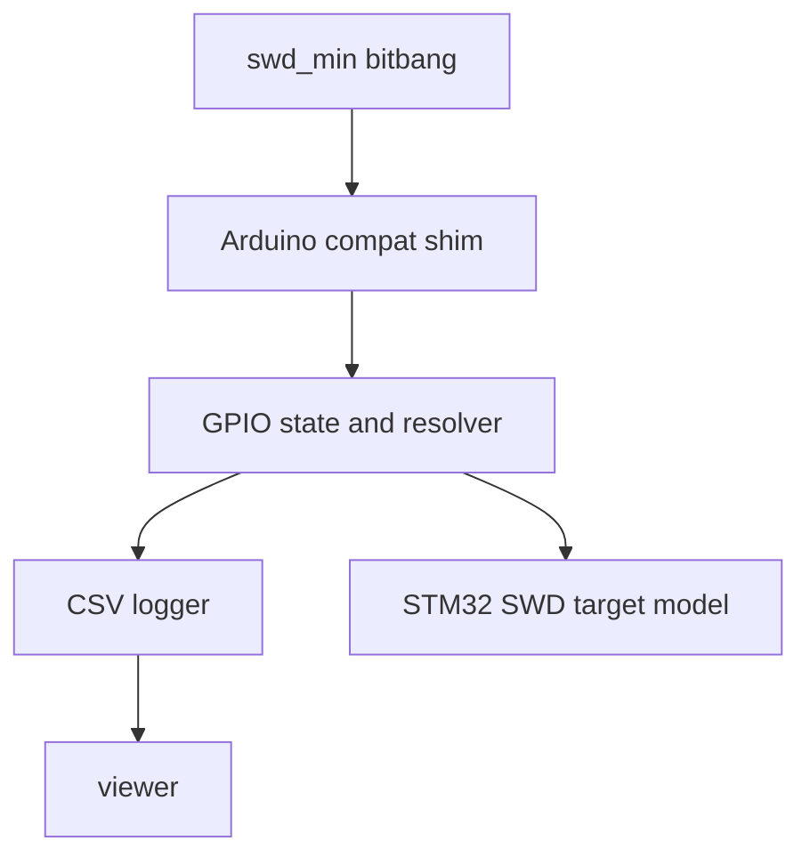

# SWD Signal Simulator + Waveform Viewer (Plan)

## Goal

Create a macOS-hosted simulator that:

1. Runs the **same SWD bit-bang code** as the ESP32 firmware (compile [`src/swd_min.cpp`](src/swd_min.cpp) directly).
2. Replaces Arduino/ESP32 primitives (`pinMode`, `digitalWrite`, `digitalRead`, `delay`, `delayMicroseconds`) with a host shim.
3. Logs **resolved SWCLK/SWDIO voltages vs time** to a file.
4. Simulates an STM32 SWD target sufficiently to respond to **DP IDCODE read**.
5. Provides a separate visualization tool with **pan + zoom**.

## Voltage encoding (as required)

When writing the log, represent SWDIO voltage as:

- `0.0` = host drives low
- `3.3` = host drives high
- `0.2` = floating with host pull-down
- `3.1` = floating with host pull-up
- `0.1` = STM32 drives low
- `3.2` = STM32 drives high
- `1.65` = **contention** (host and target both driving SWDIO). This is an error case we must detect; we will not crash, but we will set a flag and print a large warning at end of simulation.

SWCLK is host-driven only:
- `0.0` low, `3.3` high

## Architecture

## Code reuse strategy (minimal changes)

### Compile `swd_min` as-is

Avoid editing [`src/swd_min.cpp`](src/swd_min.cpp). Instead, for the host build:

- Provide a stub header named `Arduino.h` earlier in the include path than the real Arduino core.
- Implement compatible symbols:
  - `pinMode(int pin, int mode)`
  - `digitalWrite(int pin, int value)`
  - `int digitalRead(int pin)`
  - `delay(unsigned ms)`
  - `delayMicroseconds(unsigned us)`
  - constants: `HIGH`, `LOW`, `INPUT`, `OUTPUT`, `INPUT_PULLUP`
  - helpers/macros used by `swd_min`: `F(...)`, `__FlashStringHelper`

This lets the simulator build the same algorithm source file.

## Repository layout

Create two host-side subprojects:

- `sim/` (C++): produces `swd_sim` executable
  - `sim/CMakeLists.txt`
  - `sim/arduino_compat/Arduino.h` (stub)
  - `sim/arduino_compat/arduino_compat.cpp` (shim implementation)
  - `sim/gpio_model.h/.cpp` (pin modes, pullups, resolved voltages)
  - `sim/logger.h/.cpp` (CSV log writer)
  - `sim/stm32_swd_target.h/.cpp` (SWD target responder)
  - `sim/main.cpp` (calls `swd_min::begin`, `reset_and_switch_to_swd`, `read_idcode`, prints result)

- `viewer/` (Python or JS): produces an interactive waveform viewer
  - Preferred: `viewer/view_log.py` using Plotly (interactive pan/zoom in browser)

## Timing model

Simulator maintains monotonic `uint64_t t_ns`.

- `delayMicroseconds(us)` => `t_ns += us * 1000`
- `delay(ms)` => `t_ns += ms * 1000000`
- `pinMode` and `digitalWrite` are instantaneous (log at current `t_ns`)

Optional later: add a small per-call cost if needed.

## GPIO model + resolution

Track per pin:

- direction: input or output
- output value: 0 or 1
- input pull: none, pull-up, pull-down

Resolved voltage for SWDIO at any time:

0. **Contention detection (first priority)**:
   - If **host is OUTPUT** and **target is driving** at the same time, this is illegal.
   - Set `contention_seen = true` and log SWDIO voltage as `1.65` at that time so it is visually obvious.

1. If target is driving SWDIO:
   - drive 0 => `0.1`
   - drive 1 => `3.2`
2. Else if host pin is OUTPUT:
   - output 0 => `0.0`
   - output 1 => `3.3`
3. Else (host input):
   - pull-down => `0.2`
   - pull-up => `3.1`
   - no pull => choose `3.1` (default idle high) unless you prefer `nan` (we can pick one)

Resolved voltage for SWCLK is always host output (`0.0` or `3.3`).

## STM32 SWD target model (IDCODE only)

Implement a minimal state machine driven by SWCLK edges.

### Edge integration point

In the shim `digitalWrite(SWCLK, ...)`:

- On a transition to HIGH, call `target.on_swclk_rising_edge(resolved_swdio_level)`.
- On a transition to LOW, optional (usually not needed for SWD).

In the shim `digitalRead(SWDIO)`:

- Return the resolved logic level based on whether target is currently driving.

### Target behavior

- Detect line reset: count consecutive SWCLK rising edges where host is driving SWDIO high; when >= 50 mark `line_reset_seen`.
- Detect JTAG-to-SWD switch: after a line reset, sample 16 bits LSB-first and match 0xE79E.
- After switch, respond to a single DP read of IDCODE:
  - Parse 8-bit request (LSB first) and validate start, stop, park, parity.
  - If request is DP read, addr 0x00, respond with:
    - turnaround handling (host releases, target drives)
    - ACK OK bits `001`
    - 32-bit IDCODE LSB-first
    - odd parity bit
    - then release line for turnaround back

IDCODE constant will be configurable in `stm32_swd_target`.

## Log format

Write `signals.csv` with rows only when a resolved voltage changes:

- `t_ns,signal,voltage`

Where `signal` is one of: `SWCLK`, `SWDIO`, `NRST`.

## Viewer tool (pan + zoom)

Implementation: Python + Plotly -> generates a self-contained `waveforms.html`.

- Viewer script: [`viewer/view_log.py`](viewer/view_log.py:1)
- Behavior:
  - reads `signals.csv`
  - reconstructs step-wise waveforms
  - writes `waveforms.html` and attempts to open it

Controls (trackpad-focused):

- two-finger left/right: **pan horizontally**
- two-finger up/down: **zoom horizontally** (time axis only)
- y-axis zoom is fixed

Traces are extended to the final timestamp in the log so every plot ends with a horizontal segment.

## End-of-run warnings

- If `contention_seen` is true, print a prominent warning to stdout at the end of `swd_sim` (do not crash).

## Acceptance checks

1. Running `swd_sim` prints `ACK OK` and the configured IDCODE.
2. `signals.csv` visually shows:
   - 80+ cycles of SWDIO high during line reset
   - 16-bit 0xE79E sequence
   - a DP IDCODE read packet
   - SWDIO changing from host-driven to floating to target-driven around turnarounds
3. Viewer loads the CSV and supports pan/zoom clearly.

## Planned work items

- Add `sim/` CMake project that compiles [`src/swd_min.cpp`](src/swd_min.cpp) unchanged using `sim/arduino_compat/Arduino.h`.
- Implement shim + GPIO resolver + CSV logger.
- Implement `stm32_swd_target` (IDCODE only).
- Add `viewer/view_log.py` (Plotly) for interactive waveform viewing.
- Document build/run:
  - `cmake -S sim -B sim/build && cmake --build sim/build && ./sim/build/swd_sim`
  - `python3 viewer/view_log.py signals.csv`
