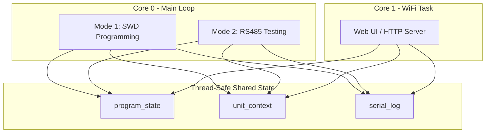
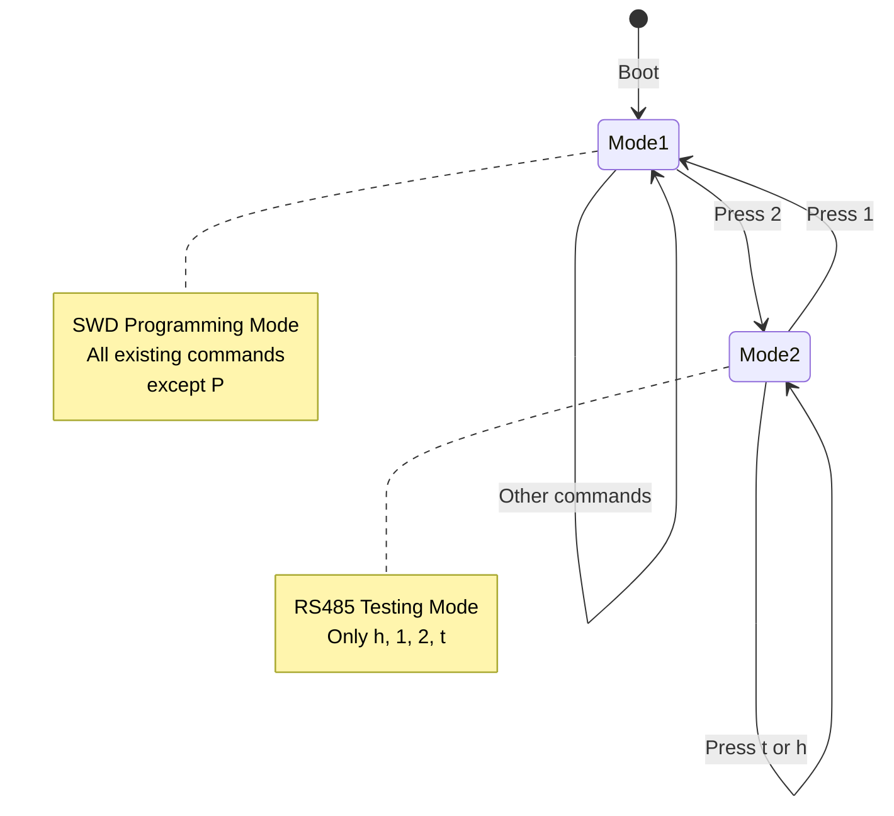

# Dual-Mode Architecture Plan

## Part 1: Human-Readable Overview

### Goal

Split the firmware into two operational **modes** with separate event loops and command sets. This separation makes the codebase more maintainable and allows future expansion of each mode independently.

### Current State

The existing [`src/main.cpp`](src/main.cpp:1) implements a single event loop with ~20 commands for:
- SWD programming (i, e, w, v, R, etc.)
- Serial/filesystem management (f, F, s, S, l, etc.)
- Debug/diagnostics (h, d, b, c, p, r, T, t, m, a)
- RS485 servomotor upgrade (u, P)
- Production sequence (space, GPIO45 button)

The `P` command (servomotor get product info) will be removed.

### New Architecture

**Mode 1** - SWD Programming Mode (default on boot):
- Contains all existing commands except `P` (removed from Mode 1)
- Adds `1` and `2` for mode switching
- Handles production button and production sequence

**Mode 2** - RS485 Testing Mode:
- Separate event loop in a new source file
- Commands include basic RS485 motor operations:
  - `R` = motor system reset (enter bootloader)
  - `e` / `d` = enable/disable MOSFETs
  - `t` = trapezoid move (1 rotation for 1 second)
  - `p` = get comprehensive position (prints read-back values)
  - `i` = get product info

### Mode Switching

- Press `1` → switch to Mode 1 (SWD Programming)
- Press `2` → switch to Mode 2 (RS485 Testing)
- Both modes implement both commands so switching is always possible
- Mode switching prints a banner indicating the active mode

### New Files

| File | Purpose |
|------|---------|
| `src/mode2_loop.cpp` | Mode 2 event loop and command handlers |
| `src/mode2_loop.h` | Public interface for Mode 2 |

### Command Summary

| Command | Mode 1 | Mode 2 |
|---------|--------|--------|
| `1` | Stay in Mode 1 (print banner) | Switch to Mode 1 |
| `2` | Switch to Mode 2 | Stay in Mode 2 (print banner) |
| `h` | Print Mode 1 help | Print Mode 2 help |
| `t` | Dump RAM terminal buffer | Trapezoid move (1 rotation for 1 second) |
| `l` | Not available | LED test: GREEN+RED LEDs on solid (indefinite) |
| `f,F,i,s,S,l,R,m,d,b,c,p,r,e,w,v,a,<space>` | Available | Not available |

Mode 2 now uses `p` for comprehensive position and `i` for product info.

---

## Shared State Architecture (Important)

The project already has good separation of concerns. The Web UI runs on a separate FreeRTOS core and accesses shared data through thread-safe modules:

| Module | Purpose | Thread-Safe |
|--------|---------|-------------|
| [`program_state`](src/program_state.cpp) | Active firmware filename | Yes (mutex) |
| [`unit_context`](src/unit_context.cpp) | Last programmed unit serial/unique_id | Yes (mutex) |
| [`serial_log`](src/serial_log.cpp) | Serial number management, log files | Yes (mutex) |

**No restructuring required.** Mode 2 can use the same shared state modules that Mode 1 uses. The Web UI continues to work unchanged because it only accesses these thread-safe modules.



---

## Part 2: AI Implementation Details

### File Changes Overview

```
src/
├── main.cpp          # Modified: add mode state, mode-switch commands, call mode2_loop
├── mode2_loop.cpp    # NEW: Mode 2 implementation
└── mode2_loop.h      # NEW: Mode 2 header
```

### Step 1: Create Mode 2 Header

Create `src/mode2_loop.h`:

```cpp
#pragma once

namespace mode2_loop {

// Run the Mode 2 event loop. Returns when user requests switch to Mode 1.
void run();

}  // namespace mode2_loop
```

### Step 2: Create Mode 2 Implementation

Create `src/mode2_loop.cpp`:

```cpp
#include "mode2_loop.h"
#include <Arduino.h>
#include "tee_log.h"

static inline Print &LOG() { return tee_log::out(); }

static void print_user_pressed_banner(char c) {
  if (c >= 32 && c <= 126) {
    LOG().printf("=== [Mode 2] User pressed '%c' (0x%02X) ===\n", c, (unsigned char)c);
  } else {
    LOG().printf("=== [Mode 2] User pressed 0x%02X ===\n", (unsigned char)c);
  }
}

static void print_help() {
  LOG().println("Mode 2: RS485 Testing Mode");
  LOG().println("Commands:");
  LOG().println("  h = help");
  LOG().println("  1 = switch to Mode 1 (SWD Programming)");
  LOG().println("  2 = stay in Mode 2 (this mode)");
  LOG().println("  t = test (prints 'Testing... test done!')");
}

static void print_mode2_banner() {
  LOG().println("========================================");
  LOG().println("          MODE 2: RS485 Testing        ");
  LOG().println("========================================");
  LOG().println("Press 'h' for help, '1' to switch to SWD mode");
}

namespace mode2_loop {

void run() {
  print_mode2_banner();

  while (true) {
    if (!Serial.available()) {
      delay(10);
      continue;
    }

    const char c = (char)Serial.read();

    // Ignore whitespace/newlines
    if (c == '\n' || c == '\r' || c == ' ') {
      continue;
    }

    print_user_pressed_banner(c);

    switch (c) {
      case 'h':
      case '?':
        print_help();
        break;

      case '1':
        LOG().println("Switching to Mode 1 (SWD Programming)...");
        return;  // Exit run() to return to Mode 1

      case '2':
        LOG().println("Already in Mode 2 (RS485 Testing)");
        break;

      case 't':
        LOG().println("Testing... test done!");
        break;

      default:
        LOG().printf("Unknown command '%c'. Press 'h' for help.\n", c);
        break;
    }
  }
}

}  // namespace mode2_loop
```

### Step 3: Modify main.cpp

**File:** [`src/main.cpp`](src/main.cpp:1)

#### 3.1 Add include for mode2_loop

Near the top of `main.cpp`, after line 20 (after `#include "servomotor_upgrade.h"`):

```cpp
#include "mode2_loop.h"
```

#### 3.2 Remove the P command from help

In `print_help()` (around line 110), delete this line:

```cpp
LOG().println("  P = servomotor: get product info over RS485 (target by last programmed unique_id)");
```

#### 3.3 Update the help text to show mode commands

Add these lines to `print_help()` (after the existing help lines, before the production jig section around line 113):

```cpp
LOG().println("  1 = stay in Mode 1 (this mode)");
LOG().println("  2 = switch to Mode 2 (RS485 Testing)");
```

#### 3.4 Add mode banner function

Add near the other static functions in main.cpp (around line 74):

```cpp
static void print_mode1_banner() {
  LOG().println("========================================");
  LOG().println("      MODE 1: SWD Programming Mode     ");
  LOG().println("========================================");
  LOG().println("Press 'h' for help, '2' to switch to RS485 testing mode");
}
```

#### 3.5 Call Mode 1 banner at startup

In `setup()` (around line 825, after `print_idcode_attempt();`), add:

```cpp
print_mode1_banner();
```

#### 3.6 Modify the loop() function

The `loop()` function starts at line 1007. Modify it as follows:

**Add global state before `loop()` (around line 1005):**

```cpp
// Mode state: 1 = SWD Programming, 2 = RS485 Testing
static int g_current_mode = 1;
```

**Modify the switch statement in `loop()` (starts around line 1063):**

Add these new cases inside the switch:

```cpp
case '1':
  LOG().println("Already in Mode 1 (SWD Programming)");
  break;

case '2':
  LOG().println("Switching to Mode 2 (RS485 Testing)...");
  g_current_mode = 2;
  mode2_loop::run();  // Blocks until user presses '1' to return
  g_current_mode = 1;
  print_mode1_banner();
  break;
```

**Remove this case (around line 1201):**

```cpp
case 'P':
  cmd_servomotor_get_product_info();
  break;
```

(Delete the entire case block for 'P' - lines 1201-1203)

### Step 4: Handle P Command Code

**Do NOT delete** these functions - the `P` command will be moved to Mode 2 in a future task:
- `cmd_servomotor_get_product_info()` in [`main.cpp`](src/main.cpp:434) (forward declaration + implementation)
- `servomotor_upgrade::print_product_info_by_unique_id()` in [`servomotor_upgrade.cpp`](src/servomotor_upgrade.cpp)

**Summary of P command changes:**
1. Remove `case 'P':` from the switch statement in `loop()` in Mode 1
2. Remove the `P` help line from `print_help()`
3. Keep all underlying functions (do not delete any code)

**Note for future implementer:** The existing `P` command code may have bugs. When moving to Mode 2, review and test carefully.

### Verification Checklist

After implementation, verify:

1. `pio run` compiles without warnings
2. `./test.sh` passes
3. Manual test plan (human must execute and confirm):
   1. Boot the device → observe serial output shows "MODE 1: SWD Programming Mode" banner
   2. Press `h` → shows Mode 1 help with `1` and `2` commands listed, `P` command NOT listed
   3. Press `P` → should say "Unknown command 'P'"
   4. Press `2` → switches to Mode 2, shows "MODE 2: RS485 Testing" banner
   5. Press `h` → shows Mode 2 help (only h, 1, 2, t commands)
   6. Press `t` → prints "Testing... test done!"
   7. Press `2` → prints "Already in Mode 2"
   8. Press `1` → switches back to Mode 1, shows Mode 1 banner again
   9. Press `1` → prints "Already in Mode 1"
   
   **Expected output snippets:**
   - Mode 1 banner: `"======== MODE 1: SWD Programming Mode ========"`
   - Mode 2 banner: `"======== MODE 2: RS485 Testing ========"`
   - Test command: `"Testing... test done!"`

### Mermaid Diagram: Mode Switching Flow



### Future Expansion

The 'P' command will be added to mode 2 shortly, so if there is code for mode 'P' lying around then we may want to consider keeping it rather than deleting it. However, existing code for 'P' is likely wrong or buggy.

Mode 2 is designed as a placeholder for RS485 testing commands. Future additions might include:
- Motor communication tests
- RS485 bus diagnostics
- Servomotor parameter queries
- Firmware verification over RS485

The architecture separates concerns so these can be added without cluttering the SWD programming code.

---

## Quick Reference: Changes Summary

### New Files to Create

| File | Action |
|------|--------|
| `src/mode2_loop.h` | Create new (see Step 1) |
| `src/mode2_loop.cpp` | Create new (see Step 2) |

### Files to Modify

| File | Changes |
|------|---------|
| `src/main.cpp` | Add include, add mode banner, add mode switch cases, remove P case, update help |

### Line References for main.cpp

| Line | Current Content | Action |
|------|-----------------|--------|
| ~20 | `#include "servomotor_upgrade.h"` | Add `#include "mode2_loop.h"` after this |
| ~74 | Near `print_user_pressed_banner()` | ADD `print_mode1_banner()` function |
| ~110 | `P = servomotor...` help line | DELETE this line |
| ~113 | Before production jig section | ADD `1` and `2` help lines |
| ~829 | After `print_idcode_attempt();` | ADD `print_mode1_banner();` call |
| ~1005 | Before `void loop()` | ADD `g_current_mode` variable |
| ~1063 | Inside switch statement | ADD `case '1':` and `case '2':` |
| ~1201 | `case 'P':` | DELETE this case block |

### DO NOT DELETE (keep for future Mode 2 migration)
- `cmd_servomotor_get_product_info()` function in main.cpp
- `servomotor_upgrade::print_product_info_by_unique_id()` function
